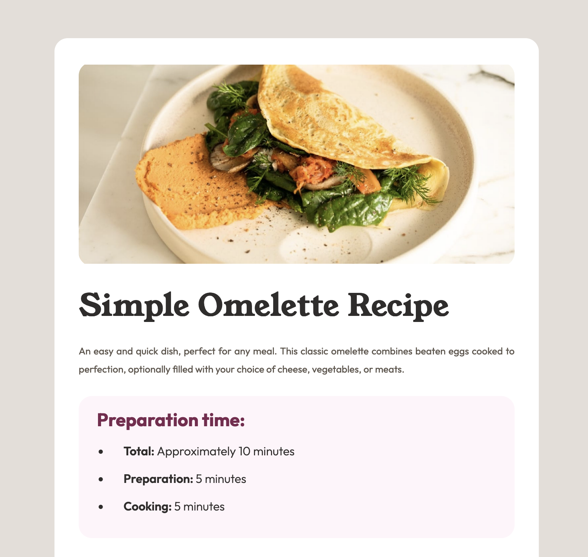

# Frontend Mentor - Recipe page solution

This is a solution to the [Recipe page challenge on Frontend Mentor](https://www.frontendmentor.io/challenges/recipe-page-KiTsR8QQKm). Frontend Mentor challenges help you improve your coding skills by building realistic projects. 

## Table of contents

- [Overview](#overview)
  - [Screenshot](#screenshot)
  - [Links](#links)
- [My process](#my-process)
  - [Built with](#built-with)
  - [What I learned](#what-i-learned)
- [Author](#author)

## Overview

### Screenshot

### Links

- Solution URL: [https://github.com/dbachour86/recipe-page-main](https://github.com/dbachour86/recipe-page-main)
- Live Site URL: [https://dbachour86.github.io/recipe-page-main/](ttps://dbachour86.github.io/recipe-page-main/)

## My process

### Built with

- Semantic HTML5 markup
- CSS custom properties
- Flexbox
- Sass

### What I learned

I am happy that I  tried Sass, it is very nice and handy to organize the CSS code. I also learned how to use the `:nth-child` pseudo-class in CSS,

## Author

- Website - [https://danibachour.com](https://www.danibachour.com)
- Frontend Mentor - [@dbachour86](https://www.frontendmentor.io/profile/dbachour86)
- LinkedIn - [@bachourd](https://www.linkedin.com/in/bachourd/)